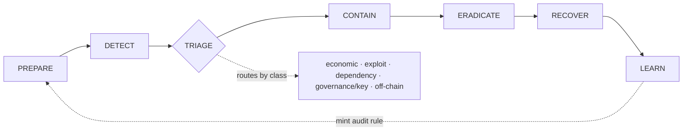

# Solana Protocol Ops & Incident Response

> **SRE / on-call for live Solana protocols** — the run-time operational layer the rest of the [Solana AI Kit](https://github.com/solanabr/solana-ai-kit) is missing. Monitor, detect, respond, trace stolen funds, recover, and turn every incident back into a build-time audit rule.

status
scope
stack
validated
license

A skill for **Claude Code, Codex / any agentic setup** covering the **run-time** life of a Solana protocol — everything that happens *after* you launch. Built for the [Solana AI Kit](https://github.com/solanabr/solana-ai-kit).

---

## ⚡ TL;DR

Existing tools keep your protocol safe **before launch**. Nothing watches it **after** but that's exactly when hacks happen: live, on mainnet, with real money draining.

This skill is that missing half. It learns your protocol's always-true rules and **sounds the alarm the instant one breaks**, walks you through the incident, **chases the stolen money across swaps and bridges**, then turns each hack into a build-time rule so the next protocol is born immune.

Proven against real Solana exploits that are still on-chain — **Cashio (~$48M)** and **Mango (~$116M)** — with committed proof you can re-run yourself.

---

## 👤 Who it's for


| If you are a…                       | Use this skill to…                                                                    |
| ----------------------------------- | ------------------------------------------------------------------------------------- |
| **Protocol SRE / on-call engineer** | Stand up invariant monitoring + webhooks *before* anything breaks                     |
| **Incident commander**              | Run the full PREPARE→…→LEARN arc with a decision tree, not improvisation              |
| **Security / forensics lead**       | Trace stolen funds value-not-token through DEX/CPI/bridges and score what's freezable |
| **Founder without a security team** | Get an incident runbook, comms templates, and a war-room structure off the shelf      |
| **Auditor handing off to run-time** | Convert each post-mortem into a build-time audit rule PR'd upstream                   |


> **Not for offense.** This is defensive / authorized-operator tooling only — protect your own protocol, trace-and-report stolen funds, coordinate with exchanges and law enforcement. It does **not** assist with "hacking back."

---

## 🎯 What it solves

Security on Solana is exhaustively covered at **build time** (`safe-solana-builder`, `trailofbits`, `qedgen`, formal verification, checklists) and almost completely empty at **run time**. When an exploit fires on mainnet — and they fire constantly — most teams improvise: no runbook, no monitoring, no forensics process, no plan for talking to exchanges or users.

This skill fills that gap with the run-time half of protocol security:

- **Monitoring & detection** that fires the instant a guaranteed-true property breaks
- **Incident response** with a real decision tree and edge-case handling
- **Fund-tracing forensics** that follows the money across swaps and bridges
- **Recovery & coordination** — whitehat negotiation, freezes, comms, post-mortem
- **A feedback loop** that turns each incident into a new build-time audit rule

---

## 🔧 How it solves it — the lifecycle




Every skill file hangs off exactly one phase. Triage routes a live incident by **class** (it is *not* all drains) into the right playbook.

### Three crown jewels (the differentiators)


| ⭐ Crown jewel                          | What it does                                                                                                                                                                                                                                                      |
| -------------------------------------- | ----------------------------------------------------------------------------------------------------------------------------------------------------------------------------------------------------------------------------------------------------------------- |
| **Invariant monitoring**               | Derive a protocol's on-chain invariants (`cash_supply <= total_backing`, `sum(balances) == vault`, `LTV <= max`) and watch them every slot. **This is the detector that catches Cashio at t=0** — zero false positives, because a breach is *proof*, not a hunch. |
| **Fund-tracing forensics**             | Forward **and** backward tracing, **value-not-token** through DEX/CPI swaps, bridge hand-off to EVM chains, and **freeze-actionability scoring** per hop — what's still in a freezable CEX / Circle-controlled USDC vs. already gone.                             |
| **Runtime → build-time feedback loop** | Every post-mortem mints a new audit rule in the format of the kit's build-time security skills and PRs it upstream, so the next protocol catches this class *at build*.                                                                                           |


---

## 🔬 How deep it goes

Not a checklist a working system with executable engines behind it.


| Depth dimension          | What's actually there                                                                                                                       |
| ------------------------ | ------------------------------------------------------------------------------------------------------------------------------------------- |
| **Coverage**             | 13 skill files spanning the entire lifecycle (3 deep crown jewels + 10 supporting pillars)                                                  |
| **Invariant derivation** | A 5-family taxonomy (conservation · solvency · custody · bounds · authority) with a step-by-step derivation procedure, not just examples    |
| **Forensics**            | Forward value-delta tracing, backward funding attribution to a KYC'd CEX, bridge hand-off, per-hop freeze scoring                           |
| **Tooling**              | Runnable TypeScript engines (`trace.ts`, `backward.ts`, `monitor.ts`) on `@solana/kit` — a safe declarative invariant evaluator (no `eval`) |
| **Orchestration**        | An `incident-commander` agent + `/incident`, `/trace`, `/watch` commands that drive the arc                                                 |
| **Closing the loop**     | Post-mortems become build-time audit rules — the only part of the kit that feeds *back* into pre-launch security                            |


---

## ✅ How reliable it is

Detectors are validated against **real exploits that are permanently on-chain**, not synthetic toys — so the proof is reproducible by anyone with an archive RPC. Each crown jewel ships a fixture and a **committed proof artifact** (captured output of an actual run):


| Exploit                      | Loss   | Validates                                                  | Proof artifact                                                   |
| ---------------------------- | ------ | ---------------------------------------------------------- | ---------------------------------------------------------------- |
| **Cashio** (Mar 2022)        | ~$48M  | Invariant monitoring (t=0 catch) + value/bridge tracing    | `fixtures/cashio-trace.json`, `fixtures/invariant-surfpool.json` |
| **Mango Markets** (Oct 2022) | ~$116M | Economic detection + backward attribution to a labeled CEX | `fixtures/mango-trace.json`                                      |


*The mechanics tracing funds and detecting the breach — genuinely work on real exploit data. But things like exact dollar prices and 'which wallet belongs to which exchange' aren't auto-magically known; a human supplies those from research, and we never make them up. And the invariant test is a faithful re-creation of the hack condition, not a byte-for-byte copy of the 2022 accounts.*

It's there so a reader trusts the project — it says "here's exactly where the automation ends and human judgment begins➡️ Full evidence and how to reproduce: **[fixtures/README.md](fixtures/README.md)**

---

## 📦 What's included


| Component                                                                                     | Description                                                 |
| --------------------------------------------------------------------------------------------- | ----------------------------------------------------------- |
| [skill/SKILL.md](skill/SKILL.md)                                                              | Entry point — routes the lifecycle spine                    |
| [skill/invariant-monitoring.md](skill/invariant-monitoring.md)                                | ⭐ Derive invariants + emit monitor/webhook                  |
| [skill/fund-tracing-forensics.md](skill/fund-tracing-forensics.md)                            | ⭐ Forward/backward, value, bridges, freeze scoring          |
| [skill/feedback-loop.md](skill/feedback-loop.md)                                              | ⭐ Mint build-time audit rules from a post-mortem            |
| [skill/incident-taxonomy.md](skill/incident-taxonomy.md)                                      | TRIAGE: route by incident class                             |
| [skill/preparedness.md](skill/preparedness.md)                                                | IR plan, SEV criteria, war-room roles, drills               |
| [skill/anomaly-detection.md](skill/anomaly-detection.md)                                      | Drain-signature heuristics, baselines                       |
| [skill/pause-guardian.md](skill/pause-guardian.md)                                            | Circuit breakers, partial pause, multisig/timelock          |
| [skill/incident-runbook.md](skill/incident-runbook.md)                                        | The decision tree + nasty edge cases                        |
| [skill/recovery-and-negotiation.md](skill/recovery-and-negotiation.md)                        | Whitehat negotiation, freezes, reimbursement                |
| [skill/comms-and-coordination.md](skill/comms-and-coordination.md)                            | Internal + external comms                                   |
| [skill/postmortem.md](skill/postmortem.md)                                                    | Auto-filled post-mortem                                     |
| [skill/resources.md](skill/resources.md)                                                      | Helius/Surfpool MCP tool map, fixtures, upstream PR targets |
| [agents/incident-commander.md](agents/incident-commander.md)                                  | Orchestrates the full arc                                   |
| [/incident](commands/incident.md) · [/trace](commands/trace.md) · [/watch](commands/watch.md) | Workflow commands                                           |
| [fixtures/](fixtures/README.md)                                                               | Executable validation against real exploits                 |


## 🔌 Data engine

Reuses MCPs already shipped in the kit — **no new dependencies**:

- **Helius MCP** — `getTransactionHistory` (money-graph walking), `parseTransaction`, `createWebhook` (live monitoring), DAS API (balances/holdings), wallet-analysis (attacker profiling).
- **Surfpool MCP** — replay a historical exploit on a mainnet fork to validate a detector or a proposed fix.

## 🚀 Installation

**Quick install (one-liner)**

```bash
curl -fsSL https://raw.githubusercontent.com/ansu555/solana-protocol-ops-skill/main/bootstrap.sh | bash
```

This clones the repo to a temp dir and runs the standard installer into `~/.claude`. Review the script first if you prefer: [bootstrap.sh](bootstrap.sh).

**Manual install**

```bash
git clone https://github.com/ansu555/solana-protocol-ops-skill
cd solana-protocol-ops-skill
./install.sh            # standard: installs to ~/.claude/skills/solana-protocol-ops
# or
./install-custom.sh     # choose personal (~/.claude) vs project (./.claude) install
```

The skill expects the Helius MCP configured (`HELIUS_API_KEY`) and, optionally, Surfpool — both already part of the Solana AI Kit's `.mcp.json`.

**Use within the Solana AI Kit (as a submodule)**

```bash
cd solana-ai-kit
git submodule add https://github.com/ansu555/solana-protocol-ops-skill .claude/skills/ext/solana-protocol-ops
```

## 🛡️ Scope & ethics

> **Defensive / authorized-operator tooling only.** Protect your own protocol, trace-and-report stolen funds, and coordinate with exchanges and law enforcement. It does **not** assist with offensive use or "hacking back." Verify program IDs, authorities, and account layouts against on-chain data before acting — live funds are at stake.

## 📍 Status

**Proven today**

- Full lifecycle written — 13 skill files (3 crown jewels + 10 pillars), orchestrator agent, 3 commands
- Every internal cross-link resolves
- Forward value-trace and backward attribution run against **real mainnet history** with committed proof artifacts (Cashio, Mango)
- Invariant monitor validated by a Surfpool synthetic reconstruction of the Cashio breach condition

**Next**

- Ship a one-command live webhook deployment guide for operators
- Broaden the fixture library to a third incident class (governance/key)
- First public release / kit submission

## 📄 License

MIT — see [LICENSE](LICENSE).