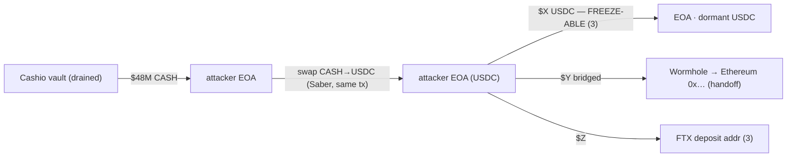

# Fund-Tracing Forensics

> **Crown jewel #2.** When funds are already gone, a graph of where they went is table stakes. The differentiator is scoring **what you can still act on**: which hops are freeze-able *right now*, which have bridged off-chain, and which are gone — so the operator spends the next hour on the recoverable 30%, not the unrecoverable 70%. Trace **value, not tokens**; classify every terminal; hand recovery a ranked action list.

Use this file when the operator asks any of: *"Where did the stolen funds go?"*, *"Can any of it be frozen?"*, *"Who is the attacker / where did they come from?"*, or *"How much is actually recoverable?"*

This is **defensive / authorized-operator** work: trace-and-report so funds can be frozen by the parties empowered to freeze them. Never move attacker funds, never "hack back."

---

## The two directions of a trace

A complete forensic trace runs **both** ways from the drain. They answer different questions and feed different downstream actions.

| Direction | Question | Starts from | Feeds |
|---|---|---|---|
| **Forward** | "Where did the money go, and what can we freeze?" | the drained vault / victim accounts | freezes, exchange notices, recovery |
| **Backward** | "Who is the attacker, and who can identify them?" | the attacker's funding / gas-payer | attribution, subpoenas, LE referral |

Forward tracing recovers funds. Backward tracing recovers *names* — the gas that paid for the exploit almost always traces back, in a few hops, to a CEX withdrawal that is KYC'd. Run both; they converge on the same actor cluster from opposite ends.

---

## Trace value, not tokens (the core skill)

Naïve tools follow a token: they watch the stolen mint and lose the trail the instant the attacker swaps it on Jupiter. **Attackers swap immediately and on purpose** — stolen-but-identifiable tokens are worthless until laundered into something liquid and fungible.

The fix is to change the unit of tracing from "this mint" to **"net value controlled by an actor."**

- **A swap is not a hop.** When an attacker sends CASH into Saber and receives USDC in the *same transaction*, that is one actor substituting one token for another. Their net position went `−CASH +USDC`. Following the USDC out is following the value; the DEX pool in the middle is noise.
- **The hop graph is inter-actor, not inter-account.** Edges are value moving from one *actor* to another. Intra-actor token substitution (swaps, wrap/unwrap, splitting across your own wallets) collapses to a single node.
- **Net at the transaction boundary, not the gross flow.** One Solana transaction can contain dozens of inner instructions (CPIs) and route through many pools. Gross transfers in a Jupiter route can be 10× the real movement. The ground truth is the **net balance delta** per account, computed from `preTokenBalances`/`postTokenBalances` and `preBalances`/`postBalances`. Diff those, price each delta at the slot, and the swap, the flash loan, and the aggregator route all net out to "actor X ended the tx with +Y value, sourced from −Z."

> **Rule:** trace an *actor's net holdings across transactions*; treat every same-tx token substitution as continuation of the same value. This is what survives a swap. Everything else is a token-flow tool that dies at the first DEX.

---

## The tracing procedure

A trace is a breadth-first walk over the value graph, not guesswork. Emit each step.

**1. Establish the seed set.** The drained vaults, the victim accounts, and the drain transaction signatures. From [invariant-monitoring.md](invariant-monitoring.md) a breach already names them; otherwise diff the vault balances across the incident window.

**2. Quantify the loss in value, at the slot.** For each drain tx, net the seed accounts' balance deltas and price them at *that slot's* price (`usdAtSlot`), not today's. "47,000 SOL" means what SOL was worth then — that is the number every downstream bucket must sum back to.

**3. Forward BFS over actors.** For each frontier actor, pull its signature history, decode each tx to a net actor-delta, and follow the dominant value **outflows** to their recipients. Collapse intra-actor swaps/wraps/self-transfers; enqueue inter-actor recipients. Prune dust (below an epsilon of the total) and known-internal protocol hops, but **never prune by token type** — value laundered into a new mint is the whole point.

**4. Classify every terminal.** Each frontier that stops moving, leaves Solana, or reaches a known entity gets a terminal state (next section).

**5. Score freeze-actionability per terminal.** The ranked output that makes this useful — what can be acted on, by whom, how fast.

**6. Backward-trace the funding source.** From the attacker's gas-payer / first-funder, walk *inflows* backward until you hit a labeled entity (CEX withdrawal, bridge, known actor) → attribution target.

**7. Emit artifacts.** Fund-flow graph + address dossier + frozen/liquid/gone ledger + ranked action list + EVM continuation hand-offs.

**Trace checklist (emit this filled in):**
- [ ] Seed set + drain txs listed, loss quantified in USD-at-slot
- [ ] Every frontier actor expanded or explicitly marked terminal
- [ ] Swaps/wraps/self-splits collapsed (value followed, not token)
- [ ] Each terminal classified + freeze-actionability scored
- [ ] Funding source traced backward to a labeled entity (or "obscured")
- [ ] Total reconciles: `frozen-able + liquid + bridged + gone == loss`

---

## Terminal classification & freeze-actionability scoring

Not all "gone" is equal. Score every terminal `0–3` on recoverability, then sort the operator's attention by it.

| Terminal state | Score | Why | Action → who | Time pressure |
|---|---|---|---|---|
| **Stablecoin (USDC/USDT) sitting in an EOA** | **3** | Issuers freeze at the token level — Circle and Tether maintain on-chain blacklists | Issuer freeze request via LE → Circle / Tether | **Hours** — attacker will swap it to volatile to escape the freeze |
| **CEX deposit address** | **3** | Centralized exchange can freeze the account + has KYC | Freeze + subpoena → exchange compliance / [comms](comms-and-coordination.md) | **Minutes–hours** before withdrawal |
| **Volatile token, dormant in EOA** | **2** | Not freeze-able by an issuer, but monitorable and negotiable | Monitor; whitehat offer → [recovery-and-negotiation.md](recovery-and-negotiation.md) | Ongoing — re-score if it swaps to stable |
| **Bridged to another chain** | **handoff** | Value left Solana; trace continues elsewhere | Emit dest chain + address; hand to that chain's analysts | Continues off-chain |
| **Through a mixer / privacy protocol** | **1** | Post-mix attribution is usually lost | Record pre-mix path only | Likely gone |
| **Off-ramped to fiat** | **0** | No on-chain handle left | Subpoena the off-ramp via LE | Gone on-chain |

**Why the stablecoin terminal is the headline finding.** Circle (USDC) and Tether (USDT) are centralized issuers that can — and on law-enforcement request do — freeze blacklisted addresses at the contract level. Any stolen value sitting as USDC/USDT in an EOA is **recoverable right now** and the single most time-sensitive item in the report. This is also *why* sophisticated attackers swap stablecoins → volatile → bridge as fast as possible: every minute as a stablecoin is a minute they can be frozen. Surface these first, with the exact addresses and amounts, so [recovery-and-negotiation.md](recovery-and-negotiation.md) can fire the freeze request before the attacker moves.

---

## Bridge hand-off (when value leaves Solana)

When the trace hits a bridge program (**Wormhole, Allbridge, deBridge, Mayan, Portal**), the value leaves Solana and this skill cannot follow it natively. Do not stop — hand off cleanly:

- Identify the **bridge** and the **source burn/lock transaction**.
- Extract the **destination chain** and **destination address** from the bridge message / VAA (Wormhole emits a VAA whose payload carries the recipient).
- Emit a continuation node: `BRIDGED → {chain} → {address} via {bridge} (tx {sig})`.
- Flag it for the destination chain's tooling (an EVM tracer, Chainalysis/Arkham, or that chain's analysts). The Solana-side trace is complete at the bridge; the value is not gone, it is *elsewhere and traceable* — say exactly where.

Bridges are the most common point where amateur traces silently end. A clean hand-off with the destination address is the difference between "funds disappeared into Wormhole" and "funds are at `0x…` on Ethereum, continue there."

---

## From trace to runnable artifacts

Emit a reusable tracer, not a one-off script. The engine is **net actor-delta per transaction**.

### The actor-delta core (`trace.ts`, `@solana/kit`)

```ts
import { createSolanaRpc, address, signature } from "@solana/kit";

const rpc = createSolanaRpc(process.env.HELIUS_RPC_URL!); // kit's Helius RPC

// Net value an actor gained/lost in one tx, by token. SOL deltas as the native mint.
// This is what collapses swaps/wraps to a substitution and survives DEX routing.
async function actorDelta(sig: string, owner: string): Promise<Record<string, bigint>> {
  const tx = await rpc.getTransaction(signature(sig), {
    maxSupportedTransactionVersion: 0, encoding: "jsonParsed",
  }).send();
  const m = tx!.meta!;
  const delta: Record<string, bigint> = {};
  // SPL token deltas owned by `owner`
  const pre = indexByOwnerMint(m.preTokenBalances ?? []);
  const post = indexByOwnerMint(m.postTokenBalances ?? []);
  for (const key of new Set([...Object.keys(pre), ...Object.keys(post)])) {
    const [o, mint] = key.split("|");
    if (o !== owner) continue;
    const d = (post[key] ?? 0n) - (pre[key] ?? 0n);
    if (d !== 0n) delta[mint] = (delta[mint] ?? 0n) + d;
  }
  // native SOL delta (lamports), via the account's index in the message
  const i = accountIndex(tx!, owner);
  if (i >= 0) {
    const d = BigInt(m.postBalances[i]) - BigInt(m.preBalances[i]);
    if (d !== 0n) delta["SOL"] = (delta["SOL"] ?? 0n) + d;
  }
  return delta; // e.g. { CASH: -28_840_000n, USDC: +28_800_000n }  → swap, follow the +
}
```

### The forward BFS

```ts
async function forwardTrace(seeds: string[], lossUsd: number) {
  const queue = [...seeds], seen = new Set<string>(), graph: Edge[] = [];
  while (queue.length) {
    const actor = queue.shift()!;
    if (seen.has(actor)) continue;
    seen.add(actor);
    for (const sig of await rpc.getSignaturesForAddress(address(actor), { limit: 1000 }).send()) {
      const delta = await actorDelta(sig.signature, actor);
      for (const [mint, amt] of Object.entries(delta)) {
        if (amt >= 0n) continue;                          // only follow OUTflows
        const to = recipientOf(sig.signature, actor, mint);  // counterparty in this tx
        const usd = await usdAtSlot(mint, -amt, sig.slot);
        if (usd < EPSILON * lossUsd) continue;            // prune dust, NOT by token
        graph.push({ from: actor, to, mint, amount: -amt, usd, tx: sig.signature, slot: sig.slot });
        if (!isInternal(to) && !isTerminal(to)) queue.push(to);  // collapse swaps/bridges/CEX
      }
    }
  }
  return classifyAndScore(graph); // → ledger + dossier + freeze-action list
}
```

`labelAddress`, `usdAtSlot`, `recipientOf`, `isTerminal` are pluggable: Helius known-address lists + DAS for labels, a price oracle keyed by slot, the tx's net deltas for `recipientOf`. The skill ships the structure; the program-specific wiring is filled at trace time. Keep keys **read-only** — a tracer needs no write authority, ever.

### Output 1 — the fund-flow graph (Mermaid)



### Output 2 — address dossier (per significant node)

```json
{
  "address": "<attacker EOA>",
  "label": "unknown EOA", "entity_type": "eoa",
  "first_seen_slot": 0, "funded_by": "<backward-trace result>",
  "received": [{ "token": "CASH", "amount": "...", "usd_at_slot": 0, "from": "<vault>", "tx": "...", "slot": 0 }],
  "sent":     [{ "token": "USDC", "amount": "...", "usd_at_slot": 0, "to": "<bridge>", "tx": "...", "slot": 0 }],
  "terminal_state": "active",
  "cluster": ["<co-funded / co-spending addrs>"]
}
```

### Output 3 — the frozen / liquid / gone ledger (the headline)

```
LOSS (USD @ slot):                 $48,000,000   (100%)
─────────────────────────────────────────────────────
FREEZE-ABLE NOW (score 3):         $ 6,200,000   (13%)  → Circle/Tether + FTX, act in hours
LIQUID / NEGOTIABLE (score 2):     $ 4,100,000   ( 9%)  → monitor + whitehat offer
BRIDGED (handoff → Ethereum):      $31,500,000   (66%)  → continue on EVM, addrs attached
GONE (mixer / off-ramp, 0–1):      $ 6,200,000   (13%)  → LE referral only
```

That four-line ledger is the deliverable a CISO acts on. Numbers are illustrative; the trace fills them.

---

## Worked example: tracing Cashio

Cashio (Mar 2022, ~$48M) minted unbacked CASH against fake collateral, then **swapped through Saber → bridged → FTX**. A token-only trace dies at Saber. Value tracing does not:

1. **Seed + loss.** [invariant-monitoring.md](invariant-monitoring.md)'s `cash-solvency` breach names the fake mint and the attacker EOA; net the drain to ~$48M @ slot.
2. **The swap is a substitution, not a hop.** `actorDelta` on the Saber tx returns `{ CASH: −big, USDC/UST: +big }` for the *same* actor. The pool is noise; follow the stablecoin out. **This is verified on real mainnet data** — see [`../fixtures/`](../fixtures/): on the actual Saber tx `3qeUYN3s…` (93s after the `+2,000,000,000 CASH` drain) the attacker EOA nets `−1,972,506,869 CASH` → `+17,041,006 USDC` + `+8,646,022 UST` in one transaction, with the two Saber pools showing up as the discardable counterparties.
3. **Branch at the stablecoins.** Value that **sits as USDC/UST in an EOA scores 3** (issuer-freezable, surface first). Value that enters **Wormhole** becomes a `BRIDGED → Ethereum 0x…` hand-off node. Value reaching an **FTX** deposit address scores 3 (exchange freeze + KYC).
4. **Backward trace** the gas-payer to its funding CEX withdrawal → attribution target.
5. **Ledger out**: freeze-able now vs. bridged vs. gone. The known historical fact that some funds were later returned to wallets under a threshold maps directly to the "liquid/negotiable" bucket — exactly the [recovery-and-negotiation.md](recovery-and-negotiation.md) hand-off.

For **Mango Markets** (Oct 2022, ~$116M, oracle manipulation) the forward trace is short — funds largely stayed identifiable on Solana — so the leverage is **backward attribution**: starting from the attacker account and walking *inflows* backward reaches a KYC'd CEX withdrawal, and the attacker self-identified. That fixture exercises step 6, not step 3. It is shipped as the runnable [`backward.ts`](../fixtures/backward.ts) engine + [`run-mango.ts`](../fixtures/run-mango.ts) driver (`npm run trace:mango`) — the same immutable-history approach as Cashio, in the opposite direction.

---

## Validate the trace against the immutable record

Forensics has a property monitoring lacks: **the history is permanent and public**, so you do not even need a fork. Point the tracer at mainnet history for a documented exploit and assert it reconstructs the known route:

1. Run `forwardTrace` from the documented Cashio seed addresses against mainnet history.
2. Assert the graph reaches the documented terminals: the Saber substitution, the Wormhole bridge node (with the right destination chain), and the CEX deposit.
3. Assert the frozen/liquid/gone ledger sums back to the documented ~$48M within epsilon.
4. Re-run for **Mango** and assert the *backward* trace reaches the documented funding CEX.

If the tracer can't rebuild a route that is already public knowledge, it won't find a novel one. (Use **Surfpool** only if you need to trace a *hypothetical* route — e.g., "where would funds go if the attacker used bridge X" — since that path isn't on mainnet yet. See [resources.md](resources.md).)

> **Run it.** Steps 1–2 are implemented and executed in [`../fixtures/`](../fixtures/) — `trace.ts` is the runnable forward engine, `run-cashio.ts` drives it against the real Cashio drain + Saber swap, and `cashio-trace.json` is the captured output. `npm run trace:cashio` with an archive RPC reproduces it. The backward direction (step 4) is `backward.ts` + `run-mango.ts` (`npm run trace:mango`), also **executed** against immutable history: from Eisenberg's MangoAccount1 owner EOA `yUJw9a…` it reaches a labeled FTX hot wallet in **1 hop** (`+24,838.2 USDC`, 2022-10-11, ~2.5h pre-exploit) — captured in `mango-trace.json` (`reachedLabeledTerminal: true`). The trace recovers a *name*, the deliberate contrast to Cashio's value trace. (The full `forwardTrace` BFS and the USD/label-curated ledger in steps 3–5 build on this verified core.)

---

## Helius MCP tool map (the data engine)

| Need | Helius MCP / RPC |
|---|---|
| Actor's transaction history | `getSignaturesForAddress(addr)` / `getTransactionHistory` |
| Net value delta per tx (the engine) | `getTransaction(sig)` → `pre/postBalances` + `pre/postTokenBalances` |
| Human-readable decoded tx + inner CPIs | `parseTransaction(sig)` (enhanced) |
| Counterparty / recipient in a tx | enhanced `parseTransaction` token-transfer list |
| Address labels (CEX / bridge / mixer) | known-address lists + wallet-analysis |
| Cluster related attacker wallets | DAS + co-spending / common-funder heuristics |
| Watch a frozen/dormant terminal for movement | `createWebhook` (enhanced) on the terminal address |

---

## Output contract

When this skill runs, deliver — not prose:

1. **Filled trace checklist** for the incident.
2. **Fund-flow graph** (Mermaid) — actor nodes, value edges (token, USD-at-slot, tx, slot).
3. **Address dossier** (JSON) per significant node — labels, in/out flows, cluster, terminal state.
4. **Frozen / liquid / gone ledger** — the four-line headline, summing back to the loss.
5. **Ranked freeze-action list** — every score-3 terminal with amount + who to contact (Circle / Tether / named exchange), sorted by time pressure.
6. **Backward-attribution note** — the funding source and the entity that can identify the attacker.
7. **EVM continuation hand-offs** — bridge, destination chain, destination address per bridged branch.

---

## Edge cases & gotchas

- **Flash loans inflate gross flows.** One tx can show borrow → use → repay totaling 10× the real theft. Always use the **net** actor-delta, never sum gross transfers, or you will report a number an order of magnitude too high.
- **Wrapped SOL.** A `wSOL → SOL` unwrap is a token substitution, not a hop — value continues as native SOL. Treat wSOL and SOL as the same value unit.
- **Aggregator routes (Jupiter).** A single swap can touch a dozen pools as inner instructions. Net at the tx boundary; do **not** create a graph node per pool.
- **Peel chains / fan-out.** Attackers split value across many fresh wallets to bleed it below dust thresholds. Prune dust by **fraction of total**, not absolute amount, and cluster fan-out wallets by common funder so the pieces re-aggregate.
- **A CEX hot wallet is not the attacker.** Value landing at an exchange deposit address means *subpoena the exchange*, not "the exchange did it." Label entity type correctly or the report misdirects.
- **Price at the slot, not today.** Value every hop at the price when it moved. A volatile-token branch can look tiny today and have been the bulk of the theft at t=0.
- **Mixers end the trace honestly.** Mark post-mix as obscured; record only the pre-mix path. Do **not** fabricate a continuation past a privacy hop.
- **Defensive boundary.** Trace-and-report only. The tracer is read-only and holds no authority; recovery happens through the parties empowered to freeze — never by moving attacker funds yourself.

---

## Hand-offs

- Funds are freeze-able / negotiable → [recovery-and-negotiation.md](recovery-and-negotiation.md) (issuer freeze requests, whitehat offer, reimbursement).
- Notify exchanges / IC3 / partners with the dossier → [comms-and-coordination.md](comms-and-coordination.md).
- Not sure what incident class this is → [incident-taxonomy.md](incident-taxonomy.md).
- Trace was seeded by a detector → back to [invariant-monitoring.md](invariant-monitoring.md) / [anomaly-detection.md](anomaly-detection.md) for the breach that named the seeds.
- After recovery → [postmortem.md](postmortem.md), and [feedback-loop.md](feedback-loop.md) turns the laundering route into a detection rule (e.g. "alert when protocol funds reach a known bridge within N slots of a vault drop").
